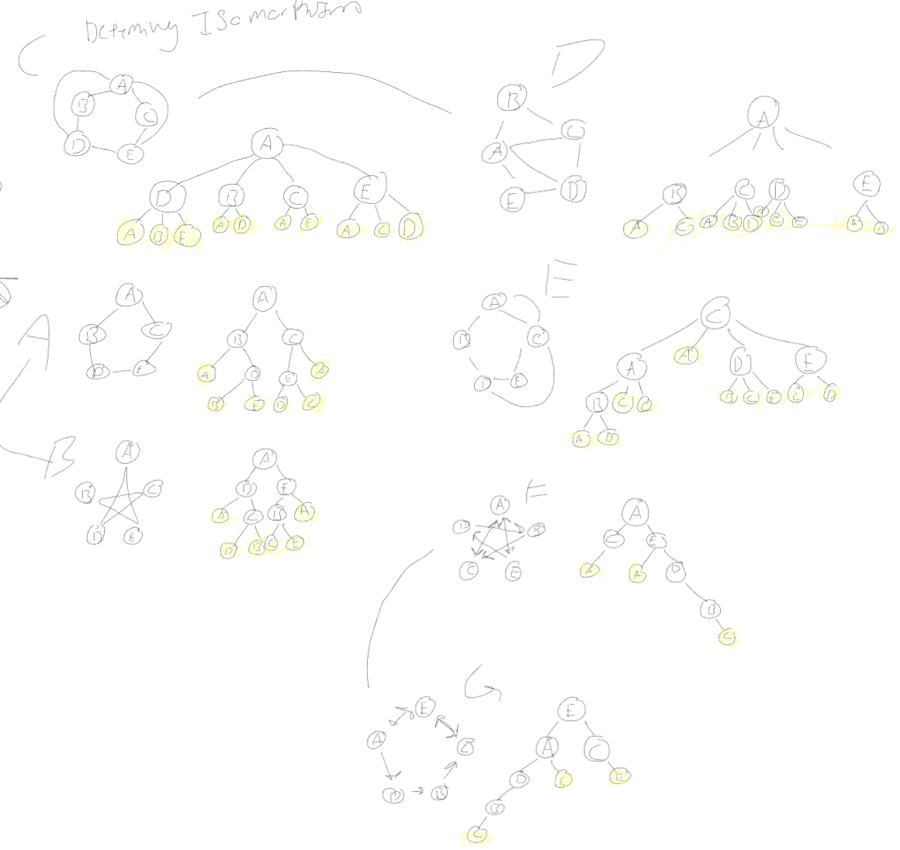

# Graph Isomorphism

Devise an algorithm to determine whether two given graphs are isomorphic or not.
It takes two graphs as an argument and returns `true` or `false`, depending on
whether the graphs are isomorphic or not. Your algorithm needs to handle both
the case where the two graphs are isomorphic and where they are not isomorphic.

Hint: Your algorithm does not need to be the best possible algorithm, but should
avoid unnecessarily repeating work.

I have not provided any test code, but you can base yours on test code from
other exercises. Your tests must check the correctness of the result of running
the function and run automatically when you commit through a GitHub action.

## Runtime Analysis

What is the worst-case big $\Theta$ time complexity of your algorithm?

ok this is discusting here are the graphs i manually computed:

so i have four main steps in my process:
1. Do the graphs have the same number of vertices and edges
    -if not return early
2. Insert every node into a priority queue weighted by the number of edges that verticie has.
3. construct a tree based on the graph and the weighted nodes.
    -the next node to be put into the tree will be based on the priority queue so we always construct our tree based on the most valuble node.
4. compare the trees, if they have exactly the same structure then they are isomorphic.

step one is done in constant time as it is just an if statement.
1

step two is done in |v| * |v| * 2log(|v|) because there is two for loops nested (each running number of verticies times) with an enqueue at the end. on average enqueue only has to iterate though half of the list so its like i said.
log(|v|)|v|^2

step three is constructing a tree:
the loop in constructing a tree runs the length of the nodeQueue meaning |v| because the nodeQueue has one entry for every node in the graph, this in practice doesnt happen because the following code will remove items from this queue once they are added to the tree, this is done to build a tree next to the first one if there are islands. the 2nd loop run |v| ammount of times to construct the tree from each node in the queue. Finally There is another loop that runs though the height of the adjMatrix, |v|, to find if the row has any unvisited connections. $|v| * |v| * |v| \in |v|^3$

step four is comparing trees, this function goes though each node one graph1 and makes shure that there is a corresponding node in graph2. This function only runs |v| times, one for every node that exists. could end early if the they dont match node for node.

So my conclusion is $1 + log(|v|)|v|^2 + |v|^3 + |v| \in \theta(|v|^3)$

Watched these videos to understand Isomorphism
https://www.youtube.com/watch?v=EwV4Puk2coU
https://www.youtube.com/watch?v=RoDR40UG--s

the priority que is copied and pasted from the frist result on google.
the construct_tree functions were made with help from ChatGPT using my requirements.

I certify that I have listed all sources used to complete this exercise, including the use of any Large Language Models. All of the work is my own, except where stated otherwise. I am aware that plagiarism carries severe penalties and that if plagiarism is suspected, charges may be filed against me without prior notice.